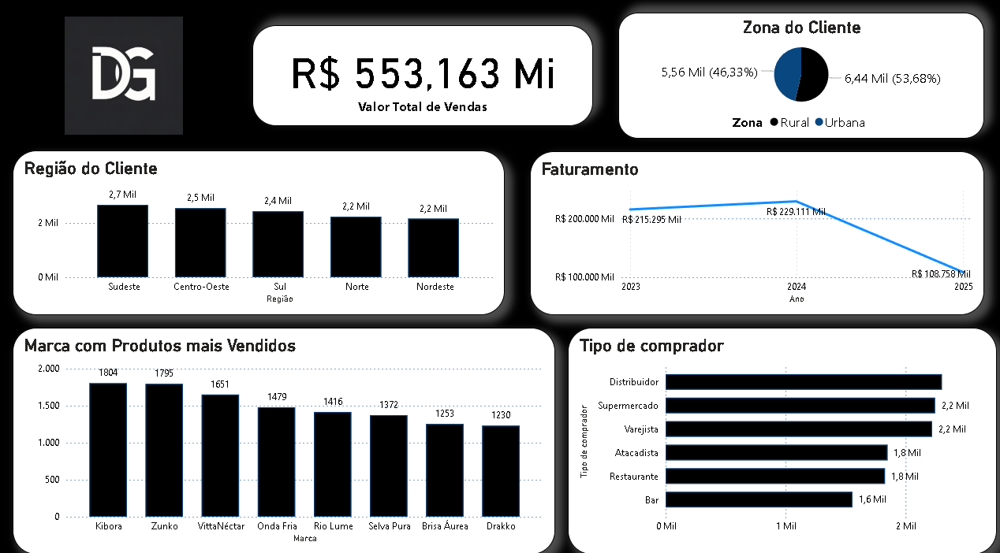

# 📊 Análise de Vendas - Adega (Projeto de Portfólio)

## 📌 Sobre o Projeto

Este projeto apresenta uma análise de dados de vendas de uma adega, considerando diferentes tipos de compradores, regiões e desempenho de produtos.

Os dados utilizados são fictícios e fora, gerado pelo meu professor para minha ultima apresentação no curso de POWER BI no SENAI, projeto foi desenvolvido por mim e minha dupla David, com foco no desenvolvimento de habilidades analíticas e construção de dashboards.

---

## 📷 Dashboard

---

## 📈 Principais observações

* Queda significativa no faturamento em 2025, indicando possível problema comercial ou operacional
* Forte dependência de distribuidores como principal canal de vendas
* Região Sudeste lidera volume de clientes
* Oportunidade de crescimento nas regiões Norte e Nordeste
* Concentração de vendas em poucas marcas

---

## 🛠️ Ferramentas Utilizadas

* Power BI
* Excel

---

## 🎯 Objetivo

Demonstrar habilidades em:

* Análise de dados
* Interpretação de métricas
* Geração de insights estratégicos
* Construção de dashboards

---

## 👨‍💻 Autor

Guilherme Humberto
